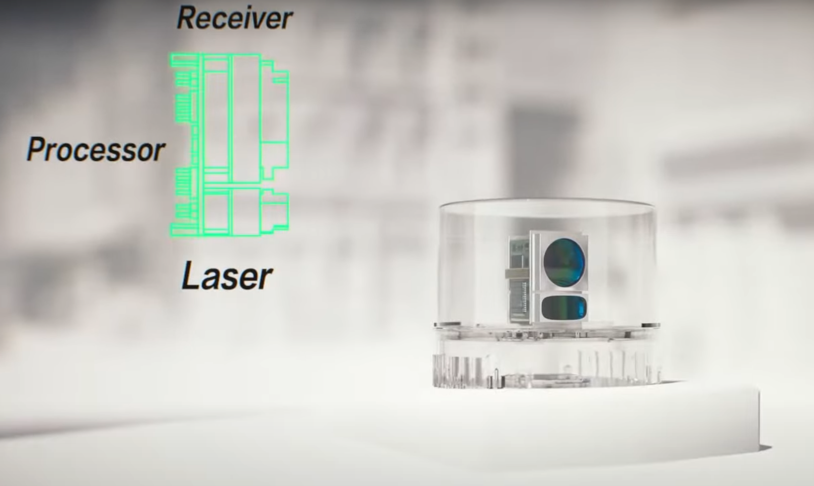
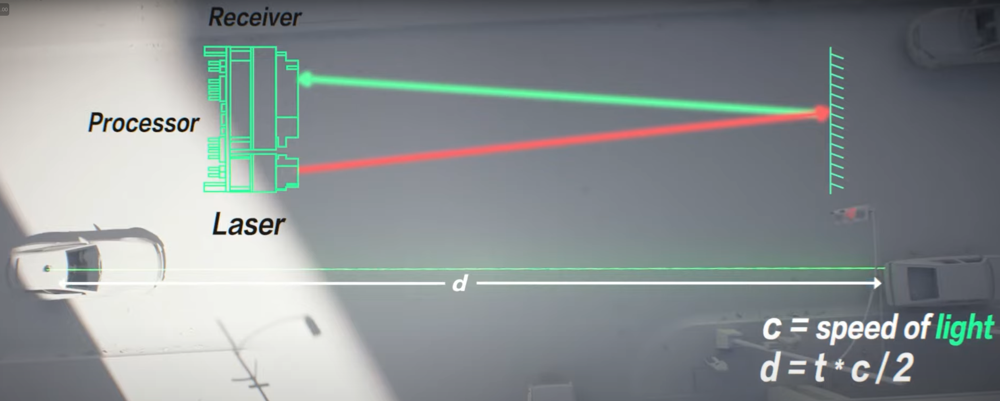
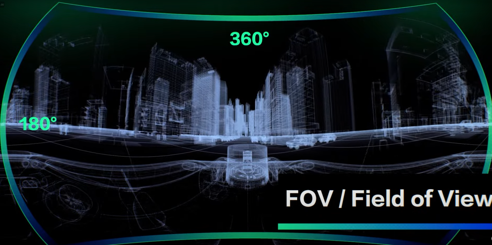
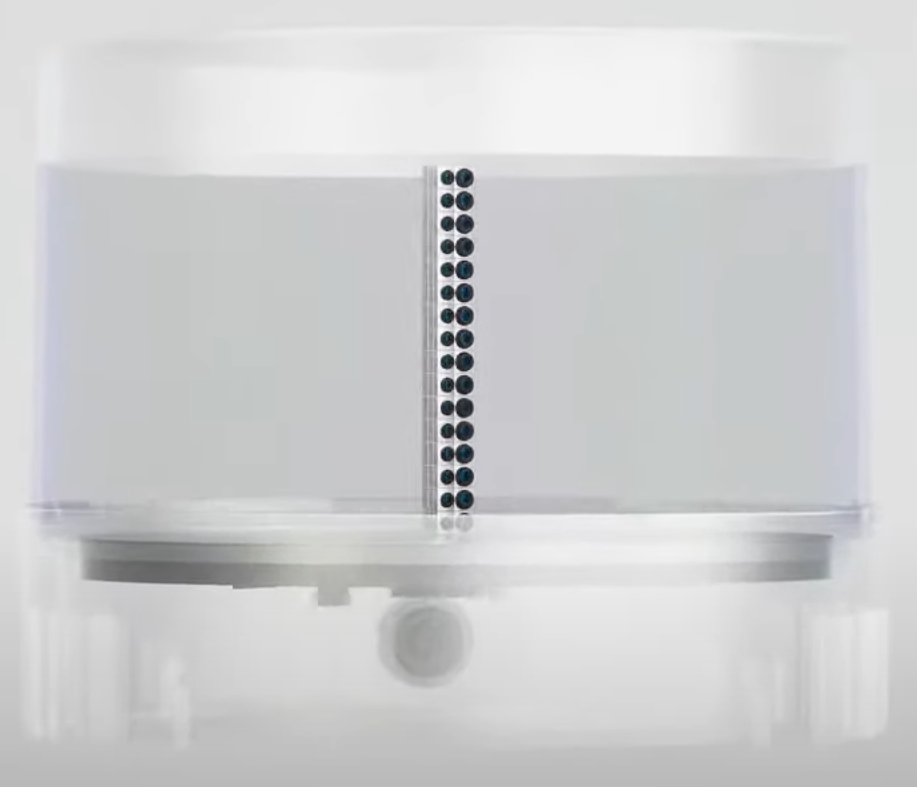
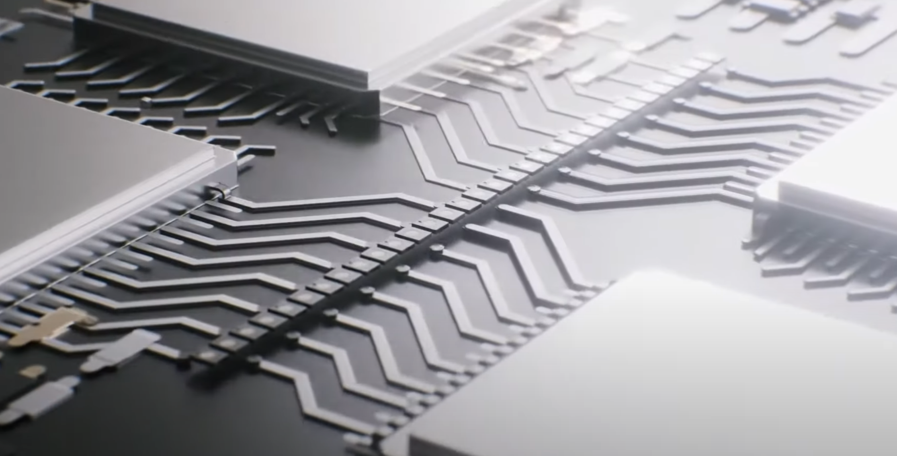

라이다의 종류에 대해서 알아보자

## 라이다 개요

라이다는 기본적으로 Laser, Recevier, Processor로 구성되어 있다.

Laser에서 빛을 쏘고, 이 빛이 장애물에 반사가 되면, Receiver가 빛을 받는다. 이때 거리를 측정하기 위해, 빛의 속도와 시간을 이용한다. 이 기술을 TOF(Time of Flight) 라 부른다.
$$
c = speed\ of\ light \\
d = t*c/2
$$

## 고려해야하는 사항 (Spec)

**1. FOV (Field of View)**

- 어느정도의 영역을 커버할 수 있는 가를 말함

**2. Range**

**3. Resolution**

**4. accuary**

## 라이다의 타입

3D 라이다는 다양한 타입의 모델이 존재한다.

1. Spinning type

   

   - 위 그림과 같이 센서들이 수직으로 배열되어 있으며, 모터가 센서를 회전시켜가면서 값을 취득하는 방법이다.

   - 이는 수직으로 배열된 레이저 모듈이기에 거리가 증가함에 따라 point의 밀도는 점차적으로 줄어든다. 

   - detection range와 resolution을 증가시키기 위한 한가지 방법은 transmit-receive 모듈을 추가하는 것이다.

   - 센서의 수가 늘어날수록, calibration을 하기가 힘들어져 비용이 기하급수적으로 증가한다.

     

2. Hybrid solid-state LiDAR

   

   - 제한된 각도로 회전하는 두개의 거울을 사용한다.
   - 폴리곤 거울은 회전하며 레이저가 수평으로 스캔되도록 하고, 위아래로 흔들리는 거울을 레이저 빔을 수직으로 굴절시킨다.
   - spinning type에 비해서 매우 높은 hz가 필요하다. 즉 잘 고장날 가능성이 높다.

3. MEMS module LiDAR

   

   1. MEMS 시스템을 통해 고주파로 회전하며 레이저 빔을 반사하는 방식임.
   2. Recevier가 먼 거리의 물체를 감지하기 위해서는 충분한 빛을 받아야하기에 먼 거리의 값을 측정하기 어렵다.
   3. 거울이 커질수록 고주파의 진동을 견디기 어렵다.
   4. 내구성 문제가 있다.
   5. 제한된 회전각도로 인해 FOV가 낮다.

4. Solid-state LiDAR

   |  |  |
   | ------------------------------------------------------------ | ------------------------------------------------------------ |

   - ASIC 기술을 통해 수백개의 레이저 모듈을 단일 칩에 통합시켜 만든 LiDAR이다.
   - 이는 뛰어난 거리 측정 해상도와 정확성을 제공하며, 단순화된 제조를 통해 효율성과 일관성을 높인다.

### Reference

https://www.youtube.com/watch?v=3EehCU3csJQ&t=18s

### Image credit

https://preciseley.com/product/mems-scanning-mirror/

https://www.hesaitech.com/things-you-need-to-know-about-lidar-solid-state-and-hybrid-solid-state-whats-the-difference/