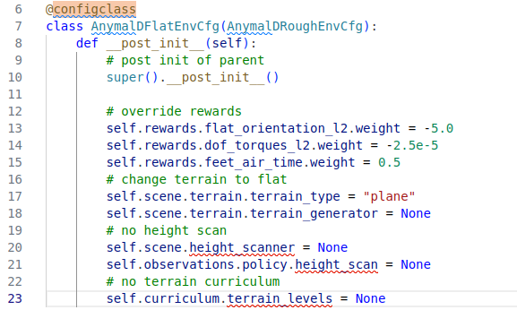

configclass vs. dataclass 비교하기

---


# ✂️TL;DR

configclass를 사용하면...

- **Type annotation**과 **Mutable default** 을 자동으로 처리하므로 사용하기 간단함
- **Class instance**와 **dictionary** 간의 쉬운 변환을 위한 유틸리티 메소드 제공
- 추가 확인 및 **post-initialization** 를 통해 데이터클래스 기능을 향상


## 🏁Introduction

본 포스팅에서는 python에서 기본적으로 제공하는 `@dataclass`와 IsaacLab에서 사용하는 `@configclass` 간의 차이점을 소개합니다.




본 포스팅을 진행하는 이유는 IsaacLab extension 프로젝트인 [IsaacLabExtensionTemplate](https://github.com/isaac-sim/IsaacLabExtensionTemplate) 에서 사용하는 코드 중  위 이미지와 같이 configclass decorator를 발견했는데, 어떠한 용도로 사용되는 지 궁금해서였다.  그래서 설명을 찾아보니 dataclass decorator를 좀 더 확장성 있게 만든 것이라고 설명을 하기에 두가지의 decorator를 비교해보고자 한다.


## 🌸Decorator란?

우선 Decorator가 뭔지 모를 수도 있으니 간단히 설명하고 넘어가도록 하겠다.


> [!NOTE]
>
> 어떤 함수를 받아 특정 역할을 수행하고 이를 다시 함수의 형태로 반환하는 함수


Python Decorator 다른 함수를 입력으로 사용하고 명시적으로 수정하지 않고 해당 동작을 확장하거나 변경하는 함수다. Decorator는 일반적으로 깔끔하고 읽기 쉬운 방식으로 함수나 메서드에 기능을 추가하는 데 사용한다.


**Decorator template**

```{python}
def my_decorator(func):
    def wrapper(*args, **kwargs):
        # Code to execute before the function call
        result = func(*args, **kwargs)
        # Code to execute after the function call
        return result
    return wrapper

@my_decorator
def my_function():
    print("Hello, World!")
```

위와 같이 my_decorator 를 만들면, 이후의 다른 함수에서 @my_decorator를 붙여서 사용할 수 있다.


**Example - logging**

```{python}
def log_decorator(func):
    def wrapper(*args, **kwargs):
        print(f"Calling function {func.__name__}")
        result = func(*args, **kwargs)
        print(f"{func.__name__} returned {result}")
        return result
    return wrapper

@log_decorator
def add(a, b):
    return a + b

add(3, 4)
```


위 실험결과로 알 수 있 듯, add 함수를 호출하면 function이 decorator 함수로 들어가서 내부 기능을 수행한 후에 결과값을 뱉어낸다.


**Example - Timing Decorator**

```{python}
import time

def timing_decorator(func):
    def wrapper(*args, **kwargs):
        start_time = time.time()
        result = func(*args, **kwargs)
        end_time = time.time()
        print(f"{func.__name__} took {end_time - start_time} seconds")
        return result
    return wrapper

@timing_decorator
def compute_square(n):
    return n * n

compute_square(10)
```


위와 같이 시간 측정 시에도 사용할 수 있다.


**Keypoints**

- **Decorators**: 실제 코드를 변경하지 않고 기능을 수정하거나 향상시킨다.

- **`@` syntax**: `@decorator_name` 문법은 Decorator를 사용하기 위한 방법이다.


## 💽Dataclass 기능

Python의 dataclass는 dataclasses 모듈(Python 3.7에서 도입됨)이 제공하는 데코레이터이자 유틸리티로, `__init__`, `__repr__`, `__eq__` 등과 같은 특수 메서드를 자동으로 생성한다. 주로 데이터를 저장하고 상용구 코드를 줄이는 데 사용되는 클래스 생성을 단순화하도록 설계되었다.


`@dataclass`로 클래스를 장식하면 Python은 자동으로 다음 메서드를 생성한다.

- `__init__`: 매개변수를 기반으로 속성을 설정하는 초기화 방법.
- `__repr__`: 읽을 수 있는 문자열 출력을 제공하는 문자열 표현 방법.
- `__eq__`: 속성을 기준으로 인스턴스를 비교하는 동등 방법.
- `__hash__`: 객체를 hashable 하게 만드는 해시 방법(선택 사항, frozen 설정에 따라 다름).
- `__post_init__`: 추가 초기화를 위해 정의할 수 있는 선택적 메소드.


```{python}
from dataclasses import dataclass

@dataclass
class Person:
    name: str
    age: int
    job: str = "Unknown"  # Default value for job

# Creating an instance
p = Person(name="Alice", age=30)

# Accessing attributes
print(p.name)  # Output: Alice
print(p.age)   # Output: 30
print(p.job)   # Output: Unknown

# Automatic __repr__ method
print(p)  # Output: Person(name='Alice', age=30, job='Unknown')

# Automatic __eq__ method
p2 = Person(name="Alice", age=30)
print(p == p2)  # Output: True
```


위 예시와 같이 dataclass를 사용하면 아래와 같은 이점들을 얻을 수 있다.

1. Boilerplate 최소화

   @dataclass 데코레이터는 `__init__`, `__repr__` 및 `__eq__`와 같은 메서드를 자동으로 생성하여 반복적인 코드를 작성하지 않아도 됨.

2. Type Annotation

    dataclass는 Python의 type hint를 사용한다. 단 각 필드에는 ype annotation이 있어야 한다.

3. Default Value

    일반 클래스 속성과 마찬가지로 필드에 기본값을 제공할 수 있다.

4. Immutability

   데코레이터에서 `frozen=True`를 설정하면 데이터 클래스를 불변으로 만들 수 있다. 즉, 생성 후에 해당 속성을 수정할 수 없다.

5. Automatic Ordering

   데코레이터에서 `order=True`를 설정하면 필드 순서에 따라 비교 방법(`__lt__`, `__le__`, `__gt__`, `__ge__`)을 자동으로 생성할 수 있습니다.


```{python}
from dataclasses import dataclass, field

@dataclass(order=True, frozen=True)
class Product:
    name: str = field(compare=False)
    price: float
    quantity: int = field(default=0, compare=False)  # Exclude from ordering

# Creating an instance
p1 = Product(name="Laptop", price=999.99)
p2 = Product(name="Tablet", price=499.99)

# Comparing products (by price since quantity is excluded)
print(p1 > p2)  # Output: True

# p1.name = "wrong"
```


## 💾configclass 분석

```{python}
def __dataclass_transform__():
    """Add annotations decorator for PyLance."""
    return lambda a: a


@__dataclass_transform__()
def configclass(cls, **kwargs):
    """Wrapper around `dataclass` functionality to add extra checks and utilities.

    As of Python 3.7, the standard dataclasses have two main issues which makes them non-generic for
    configuration use-cases. These include:

    1. Requiring a type annotation for all its members.
    2. Requiring explicit usage of :meth:`field(default_factory=...)` to reinitialize mutable variables.

    This function provides a decorator that wraps around Python's `dataclass`_ utility to deal with
    the above two issues. It also provides additional helper functions for dictionary <-> class
    conversion and easily copying class instances.

    Usage:

    .. code-block:: python

        from dataclasses import MISSING

        from omni.isaac.lab.utils.configclass import configclass


        @configclass
        class ViewerCfg:
            eye: list = [7.5, 7.5, 7.5]  # field missing on purpose
            lookat: list = field(default_factory=[0.0, 0.0, 0.0])


        @configclass
        class EnvCfg:
            num_envs: int = MISSING
            episode_length: int = 2000
            viewer: ViewerCfg = ViewerCfg()

        # create configuration instance
        env_cfg = EnvCfg(num_envs=24)

        # print information as a dictionary
        print(env_cfg.to_dict())

        # create a copy of the configuration
        env_cfg_copy = env_cfg.copy()

        # replace arbitrary fields using keyword arguments
        env_cfg_copy = env_cfg_copy.replace(num_envs=32)

    Args:
        cls: The class to wrap around.
        **kwargs: Additional arguments to pass to :func:`dataclass`.

    Returns:
        The wrapped class.

    .. _dataclass: https://docs.python.org/3/library/dataclasses.html
    """
    # add type annotations
    _add_annotation_types(cls)
    # add field factory
    _process_mutable_types(cls)
    # copy mutable members
    # note: we check if user defined __post_init__ function exists and augment it with our own
    if hasattr(cls, "__post_init__"):
        setattr(cls, "__post_init__", _combined_function(cls.__post_init__, _custom_post_init))
    else:
        setattr(cls, "__post_init__", _custom_post_init)
    # add helper functions for dictionary conversion
    setattr(cls, "to_dict", _class_to_dict)
    setattr(cls, "from_dict", _update_class_from_dict)
    setattr(cls, "replace", _replace_class_with_kwargs)
    setattr(cls, "copy", _copy_class)
    # wrap around dataclass
    cls = dataclass(cls, **kwargs)
    # return wrapped class
    return cls
```

설명을 그대로 해석하면 다음과 같다.


> `dataclass` 함수를 래퍼로 감싸서 추가 검사 및 유틸리티를 추가한다.
>
> 파이썬 3.7부터 지원을 시작한 표준 `dataclass`에는 두 가지 주요 문제가 있어서 일반적이지 않다.
>
> 1. 모든 멤버에 대해 타입 annotation이 필요함.
> 2. 가변 변수를 재초기화하기 위해 `field(default_factory=...)`를 명시적으로 사용해야함.
>
> `configclass`는 파이썬의 `dataclass` 유틸리티를 감싸는 데코레이터를 제공하여 위의 두 가지 문제를 처리한다.
>
> 또한 `dictionary <-> class`에 대한 추가 helper 함수를 제공한다. 


즉, dataclass의 부족한 부분을 채워줬다고 이해하면 된다. 아래 예제를 통해 좀 더 알아보자.


```python
@configclass
class ViewerCfg:
    eye: list = [7.5, 7.5, 7.5]  # field missing on purpose
    lookat: list = field(default_factory=[0.0, 0.0, 0.0])


@configclass
class EnvCfg:
    num_envs: int = MISSING
    episode_length: int = 2000
    viewer: ViewerCfg = ViewerCfg()

# create configuration instance
env_cfg = EnvCfg(num_envs=24)

# print information as a dictionary
print(env_cfg.to_dict())

# create a copy of the configuration
env_cfg_copy = env_cfg.copy()

# replace arbitrary fields using keyword arguments
env_cfg_copy = env_cfg_copy.replace(num_envs=32)
```


위와 같이 `to_dict` 함수를 제공함으로써 편리하게 dictioary화 하고, copy로 복사를 할 수 있다. 또한 replace를 통해 copy를 하면서 값을 변경할 수도 있다.


`configclass` 데코레이터는 구성 관리에서 발생하는 일반적인 문제를 해결하여 `dataclass` 기능을 기반으로 구축된 강력한 유틸리티이다. 
mutable한 기본값을 쉽게 처리하고, `type annotation`을 동적으로 제공하고, `replace` 및 `copy`와 같은 일반적인 작업을 위한 `utiliy method`를 제공하여 구성 클래스 생성을 단순화한다.
`configclass` 데코레이터는 구성 객체가 유연하고 강력하며 조작하기 쉬워야 하는 애플리케이션에 특히 유용하다.


 요약하자면, 아래와 같이 표로 정리할 수 있다.

|     Feature/Aspect      |                `dataclass`                 |                        `configclass`                         |
| :---------------------: | :----------------------------------------: | :----------------------------------------------------------: |
|       **Purpose**       |        General-purpose data storage        |      Configuration management with additional utilities      |
|  **Type Annotations**   |          Required for all fields           |   Automatically handled, no need for explicit annotations    |
|  **Mutable Defaults**   |   Requires `field(default_factory=...)`    |     Automatically managed, no need for `default_factory`     |
| **Post-Initialization** | Supports `__post_init__` for customization |   Augments or creates `__post_init__` for additional logic   |
|   **Utility Methods**   | Basic methods like `__init__`, `__repr__`  | Additional methods like `to_dict`, `from_dict`, `copy`, `replace` |
|    **Customization**    |        Standard dataclass features         |          Enhanced with custom checks and processing          |


## 📖Reference

1. [[Python 문법] 데코레이터 (Decorator)](https://nachwon.github.io/decorator/)