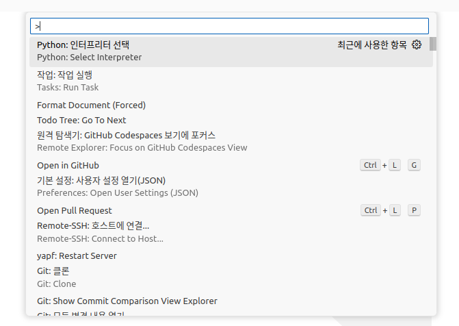
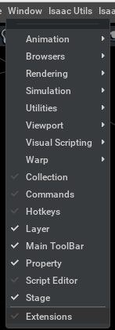
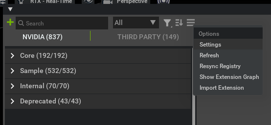
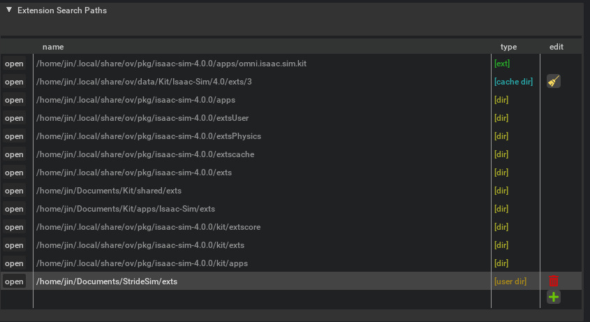

StrideSim 시뮬레이터 세팅

---


# ✂️TL;DR

StrideSim 시뮬레이터의 소개 및 설치 방법을 알려준다.


## 🏁Introduction

이번 Auturbo 5기에서 진행하고자 하는 시뮬레이터 제작 프로젝트에 대하여 소개 및 설치 방법에 대하여 안내하고자 한다.


## StrideSim이란?

TODO...


## StrideSim 설치방법

### IsaacSim 4.0.0 버전 설치하기

1. [공식 레포](https://isaac-sim.github.io/IsaacLab/source/setup/installation/pip_installation.html#installing-isaac-sim)에서 하라는대로 진행


### IsaacLab 설치하기

1. 이전에 [포스팅한 설치 가이드](https://mqjinwon.github.io/posts/240709_IsaacLab_installation/)를 따라서 진행한다.

   다만 branch는 `v1.0.0` 로 진행한다.


### StrideSim 설치하기

1. 레포 다운받기

   ```bash
   git clone https://github.com/AuTURBO/StrideSim.git
   ```

2. 설치하기

- 설치 시, IsaacLab의 가상환경에서 진행해야한다!

  ```bash
  conda activate isaaclab
  ```

- 권장하는 바는 아래 이미지 처럼, vscode에서 "python: 인터프리터 선택" 에서 isaaclab을 세팅하고 이를 활용하는 것이다.

 

- 그리고 아래와 같이 extension을 설치해준다.

```bash
cd StrideSim/exts/StrideSim
python -m pip install -e .
```


- IsaacSim을 가상환경에서 실행하는 방법은 간단하다. 먼저 환경 변수를 ~/.bashrc에 설정해준다.

  ```bash
  # ~/.bashrc
  
  # Isaac Sim root directory
  export ISAACSIM_PATH="${HOME}/.local/share/ov/pkg/isaac-sim-4.0.0"
  # Isaac Sim python executable
  alias ISAACSIM_PYTHON="${ISAACSIM_PATH}/python.sh"
  # Isaac Sim app
  alias ISAACSIM="${ISAACSIM_PATH}/isaac-sim.sh"
  ```

  - 그리고 나서는 isaaclab 가상환경에서 `ISAASIM` alias를 부른다.


- extension 설정

  - Window -> Extensions 진입

    

  - 삼지창 -> Settings

    

  - Extension Search Paths에 extension path 추가하기

    


## 📖Reference

1. 